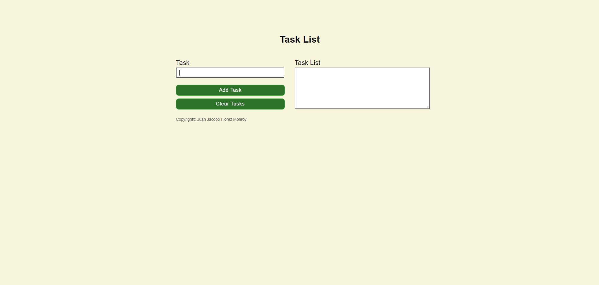

# ✅ Task List Application

## 📌 Project Overview

The **Task List Application** is a **web-based tool** that allows users to **manage their tasks efficiently**. Users can **add multiple tasks at once**, view them in a formatted list, and **clear the task list** when needed. This project focuses on **JavaScript DOM manipulation, input validation, and user-friendly task management**.

Developed as part of a **college assignment**, this project showcases skills in **interactive UI design, event handling, and form validation**.

---

## 🚀 Features

- 📝 **Add Multiple Tasks** – Users can enter **multiple tasks** separated by commas, and each task is added to the list.
- 🧹 **Clear Tasks** – Users can remove all tasks from the list with a single button click.
- 📜 **Dynamic Task Display** – Tasks are displayed **in real time** in a formatted text area.
- ❌ **Input Validation** – Ensures the user cannot add an **empty task**.

---

## 🛠 Technologies Used

- **HTML5** → Structures the user interface.
- **CSS3** → Provides responsive styling and clean UI design.
- **JavaScript (ES6)** → Implements the task management logic.
- **jQuery** → Simplifies DOM manipulation and event handling.

---

## 🎯 Project Purpose

This project was developed as part of a **college assignment**, allowing me to practice:

- ✅ **JavaScript DOM manipulation** for dynamic content updates.
- ✅ **Form validation techniques** to prevent incorrect input.
- ✅ **Event handling** for adding and clearing tasks.
- ✅ **Responsive design principles** to enhance usability.
- ✅ **User-friendly UI interaction** with dynamic feedback.

---

## 📂 Project Structure

```
📁 task_list
 ├── 📁 imgs/              # Image assets (icons, backgrounds, etc.)
 ├── 📄 index.html         # Main HTML file for the application
 ├── 📄 task_list.css      # Stylesheet for layout and design
 ├── 📄 task_list.js       # JavaScript for dynamic task handling
```

---

## 🏃‍♂️ How to Use the Application

1️⃣ **Open the Application** – Launch `index.html` in a modern web browser.
2️⃣ **Enter Tasks** – Input a task or multiple tasks separated by commas.
3️⃣ **Add Tasks** – Click **"Add Task"** to store the tasks in the list.
4️⃣ **Clear Tasks** – Click **"Clear Tasks"** to remove all tasks.
5️⃣ **Repeat** – Continue adding and managing tasks as needed.

---

## 📝 Code Highlights

### `task_list.js`:

- **Dynamic Task Handling**
  - Splits input by commas to allow multiple tasks.
  - Formats the task list dynamically using `.join("\n")`.

- **Input Validation**
  - Prevents users from adding empty tasks and shows an alert.

- **Clear Functionality**
  - Resets the task list and clears the text area instantly.

---

## 🌟 Future Improvements

- ✏️ **Edit Individual Tasks** – Add functionality to update or remove specific tasks.
- ✅ **Task Completion Status** – Enable users to mark tasks as complete or incomplete.
- 💾 **Persistent Storage** – Save the task list in **local storage** between sessions.
- 🔀 **Drag-and-Drop Reordering** – Allow users to rearrange tasks dynamically.

---

## 🎭 Screenshots  

| Task List |  
|--------------|  
|  |  

---

## 📜 License

This project was developed for **educational purposes** as part of a **college assignment**.

---

## 💼 Author

👤 **Juan Jacobo Florez Monroy**  
🌐 **Portfolio**: [jjacobo95.com](https://jjacobo95.com)  
🐙 **GitHub**: [github.com/jjacoboflorez95](https://github.com/jjacoboflorez95)